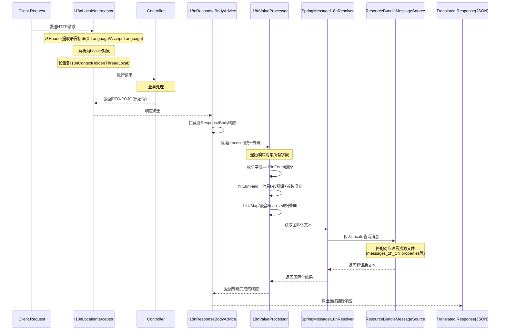

# i18n-core 模块设计文档

## 目录

1. [模块概述](#1-模块概述)
2. [整体架构](#2-整体架构)
3. [核心组件详解](#3-核心组件详解)
4. [设计模式解析](#4-设计模式解析)
5. [使用场景](#5-使用场景)
6. [快速开始](#6-快速开始)
7. [常见问题](#7-常见问题)

---

## 1. 模块概述

### 1.1 是什么

`i18n-core` 是一个**注解驱动**的 Spring Boot 国际化解决方案，通过在 DTO/POJO 上添加 `@I18nField` 注解，即可自动将响应数据中的状态码、枚举值等翻译为对应的多语言文本。

### 1.2 能解决什么问题

| 痛点 | 传统方案 | i18n-core 方案 |
|------|----------|---------------|
| 枚举显示 | 手动调用 `getDesc()` 或 `getMeaning()` | 实现 `I18nEnum` 接口，自动翻译 |
| 状态码翻译 | Controller 中手动拼接 `Map` | `@I18nField(prefix=...)` 自动生成翻译字段 |
| 多语言切换 | 每个接口手动处理 | 统一 Header 解析，自动应用 |
| 嵌套对象 | 手动递归处理 | 自动递归遍历翻译 |
| 代码侵入 | 大量重复的翻译代码 | 注解标记，零侵入 |

### 1.3 核心特性

- ✅ **注解驱动**：零侵入，仅需在字段上添加注解
- ✅ **枚举自动翻译**：实现接口即可，无需额外配置
- ✅ **智能递归**：自动处理 List、Map、嵌套 Bean
- ✅ **Header 切换**：通过 `X-Language` 或 `Accept-Language` 切换语言
- ✅ **灵活配置**：支持 prefix、target、args、replace 等属性
- ✅ **可扩展**：支持自定义消息解析器（MessageResolver）

---

## 2. 整体架构

### 2.1 架构图

```
┌─────────────────────────────────────────────────────────────────────────────────┐
│                              请求处理链路                                          │
├─────────────────────────────────────────────────────────────────────────────────┤
│                                                                                 │
│   Client Request                                                                │
│         │                                                                       │
│         ▼                                                                       │
│   ┌─────────────────────────────────────────────────────────────────────────┐   │
│   │  I18nLocaleInterceptor (HandlerInterceptor)                             │   │
│   │  ├─ 从 Header 提取语言标识 (X-Language / Accept-Language)              │   │
│   │  ├─ 解析为 Locale 对象                                                  │   │
│   │  └─ 设置到 I18nContextHolder (ThreadLocal)                              │   │
│   └─────────────────────────────────────────────────────────────────────────┘   │
│         │                                                                       │
│         ▼                                                                       │
│   ┌─────────────────────────────────────────────────────────────────────────┐   │
│   │  Controller                                                            │   │
│   │  └─ 返回 DTO/POJO (包含枚举、状态码等原始值)                            │   │
│   └─────────────────────────────────────────────────────────────────────────┘   │
│         │                                                                       │
│         ▼                                                                       │
│   ┌─────────────────────────────────────────────────────────────────────────┐   │
│   │  I18nResponseBodyAdvice (@RestControllerAdvice)                         │   │
│   │  ├─ 拦截所有 @ResponseBody 响应                                         │   │
│   │  └─ 调用 I18nValueProcessor.process() 统一处理                          │   │
│   └─────────────────────────────────────────────────────────────────────────┘   │
│         │                                                                       │
│         ▼                                                                       │
│   ┌─────────────────────────────────────────────────────────────────────────┐   │
│   │  I18nValueProcessor                                                     │   │
│   │  ├─ 遍历响应对象的每个字段                                               │   │
│   │  ├─ 枚举字段 → I18nEnum 翻译                                            │   │
│   │  ├─ @I18nField 字段 → 消息key翻译 + 参数填充                             │   │
│   │  ├─ List/Map → 递归处理每个元素                                         │   │
│   │  └─ 嵌套 Bean → 递归处理每个字段                                        │   │
│   └─────────────────────────────────────────────────────────────────────────┘   │
│         │                                                                       │
│         ▼                                                                       │
│   ┌─────────────────────────────────────────────────────────────────────────┐   │
│   │  SpringMessageI18nResolver                                              │   │
│   │  └─ 调用 Spring MessageSource，传入 Locale 获取翻译文本                 │   │
│   └─────────────────────────────────────────────────────────────────────────┘   │
│         │                                                                       │
│         ▼                                                                       │
│   ┌─────────────────────────────────────────────────────────────────────────┐   │
│   │  ResourceBundleMessageSource                                            │   │
│   │  ├─ 根据 Locale 选择资源文件 (messages.properties / messages_zh_CN)     │   │
│   │  └─ 返回翻译后的文本                                                     │   │
│   └─────────────────────────────────────────────────────────────────────────┘   │
│         │                                                                       │
│         ▼                                                                       │
│   Translated Response (JSON)                                                   │
│                                                                                 │
└─────────────────────────────────────────────────────────────────────────────────┘
```

### 2.2 组件交互时序图





```
┌────────┐     ┌─────────────────┐     ┌──────────────┐     ┌──────────────────┐
│ Client │     │Interceptor       │     │Controller     │     │ ResponseBodyAdvice│
└───┬────┘     └────────┬─────────┘     └───────┬──────┘     └────────┬─────────┘
    │                  │                         │                     │
    │ HTTP Request    │                         │                     │
    │ (X-Language)    │                         │                     │
    │────────────────>│                         │                     │
    │                  │                         │                     │
    │                  │ setLocale(locale)      │                     │
    │                  │────────────────>        │                     │
    │                  │                         │                     │
    │                  │    return DTO           │                     │
    │                  │<────────────────────────│                     │
    │                  │                         │                     │
    │                  │ process(dto, locale)    │                     │
    │                  │──────────────────────────────────────────────>
    │                  │                         │                     │
    │                  │                         │         ┌───────────┴───────────┐
    │                  │                         │         │ValueProcessor         │
    │                  │                         │         │├─ processBean()        │
    │                  │                         │         ││   └─ translateField() │
    │                  │                         │         │└─ resolveMessage()    │
    │                  │                         │         └───────────┬───────────┘
    │                  │                         │                     │
    │ Translated JSON  │                         │                     │
    │<────────────────│                         │                     │
    │                  │                         │                     │
```

---

## 3. 核心组件详解

### 3.1 组件一览表

| 组件 | 类型 | 职责 | 设计模式 |
|------|------|------|----------|
| `I18nLocaleInterceptor` | HandlerInterceptor | 语言解析与上下文设置 | - |
| `I18nContextHolder` | ThreadLocal | 线程级 Locale 存储 | ThreadLocal Pattern |
| `I18nResponseBodyAdvice` | @RestControllerAdvice | 统一拦截响应体 | AOP/Decorator |
| `I18nValueProcessor` | Service | 递归处理值翻译 | Visitor / 递归遍历 |
| `SpringMessageI18nResolver` | I18nMessageResolver | 消息解析 | Strategy |
| `I18nMessageResolver` | Interface | 消息解析器接口 | Strategy |
| `I18nEnum` | Interface | 枚举国际化契约 | - |
| `@I18nField` | Annotation | 字段翻译标记 | Annotation/配置 |

### 3.2 组件详解

#### 3.2.1 I18nLocaleInterceptor

**文件位置**: [I18nLocaleInterceptor.java](file:///d:/workspace/github/solution-hub/solution-i18n/i18n-core/src/main/java/com/cv/i18n/interceptor/I18nLocaleInterceptor.java)

**职责**: 从 HTTP 请求 Header 中提取语言标识，设置到线程上下文中。

```java
@Override
public boolean preHandle(HttpServletRequest request, HttpServletResponse response, Object handler) {
    // 1. 优先从 X-Language 获取
    String language = request.getHeader("X-Language");
    
    // 2. 回退到 Accept-Language
    if (language == null || language.trim().isEmpty()) {
        language = request.getHeader("Accept-Language");
    }
    
    // 3. 解析为 Locale 并存储
    Locale locale = I18nContextHolder.parseLocale(language);
    I18nContextHolder.setLocale(locale);
    
    return true;
}

@Override
public void afterCompletion(HttpServletRequest request, HttpServletResponse response,
                            Object handler, Exception ex) {
    // 请求完成后清理 ThreadLocal，防止内存泄漏
    I18nContextHolder.clear();
}
```

**为什么用 Interceptor 而不是 Filter？**

| 对比项 | Filter | HandlerInterceptor |
|--------|--------|-------------------|
| 执行时机 | Servlet 容器层面 | Spring MVC 层面 |
| 与 ResponseBodyAdvice 顺序 | Filter 先执行，但 finally 在 Advice 之前 | Interceptor 在 Advice 之后清理 |
| 适用场景 | 通用 Servlet 过滤 | Spring 特定功能 |

> ⚠️ **关键点**：原方案使用 Filter，在 `finally` 块中清除 Locale，但 `ResponseBodyAdvice` 是在 Filter 的 `finally` 之后执行的，导致 Locale 已被清除，翻译失败。改用 Interceptor 后，在 `afterCompletion` 中清理，确保 Advice 执行时 Locale 仍然可用。

#### 3.2.2 I18nContextHolder

**文件位置**: [I18nContextHolder.java](file:///d:/workspace/github/solution-hub/solution-i18n/i18n-core/src/main/java/com/cv/i18n/context/I18nContextHolder.java)

**职责**: 使用 ThreadLocal 存储当前请求的 Locale，实现线程隔离。

```java
public class I18nContextHolder {
    private static final ThreadLocal<Locale> LOCALE_HOLDER = new ThreadLocal<>();

    public static void setLocale(Locale locale) {
        LOCALE_HOLDER.set(locale);
    }

    public static Locale getLocale() {
        return LOCALE_HOLDER.get();
    }

    public static void clear() {
        LOCALE_HOLDER.remove();
    }
}
```

**设计思想**:
- **ThreadLocal Pattern**：每个线程独立存储，无线程安全问题
- **隐式传参**：避免在每个方法中显式传递 Locale 参数

#### 3.2.3 I18nResponseBodyAdvice

**文件位置**: [I18nResponseBodyAdvice.java](file:///d:/workspace/github/solution-hub/solution-i18n/i18n-core/src/main/java/com/cv/i18n/processor/I18nResponseBodyAdvice.java)

**职责**: 拦截所有 `@RestController` 的响应，统一进行国际化处理。

```java
@RestControllerAdvice
public class I18nResponseBodyAdvice implements ResponseBodyAdvice<Object> {

    @Override
    public boolean supports(MethodParameter returnType, Class<? extends HttpMessageConverter<?>> converterType) {
        // 仅处理非简单类型的返回（简单类型如 String、Number 直接返回）
        return !SimpleTypeHolder.isSimpleType(bodyType);
    }

    @Override
    public Object beforeBodyWrite(Object body, MethodParameter returnType,
                                  MediaType selectedContentType,
                                  Class<? extends HttpMessageConverter<?>> converterType,
                                  ServerHttpRequest request, ServerHttpResponse response) {
        // 获取当前语言上下文
        Locale locale = I18nContextHolder.getLocale();
        if (locale == null) {
            return body;
        }
        
        // 调用处理器进行翻译
        return valueProcessor.process(body);
    }
}
```

**设计思想**:
- **AOP/装饰器模式**：对原有响应进行增强，无需修改 Controller 代码
- **统一切面**：所有响应自动处理，无遗漏

#### 3.2.4 I18nValueProcessor

**文件位置**: [I18nValueProcessor.java](file:///d:/workspace/github/solution-hub/solution-i18n/i18n-core/src/main/java/com/cv/i18n/processor/I18nValueProcessor.java)

**职责**: 递归遍历并翻译响应对象中的所有字段。

**核心处理流程**:

```java
public Object process(Object value) {
    if (value == null) {
        return null;
    }
    
    Class<?> valueType = value.getClass();
    
    // 1. 枚举类型 → 自动翻译
    if (valueType.isEnum() && I18nEnum.class.isAssignableFrom(valueType)) {
        return translateEnum((Enum<?>) value);
    }
    
    // 2. 集合类型 → 递归处理每个元素
    if (value instanceof Collection) {
        return processCollection((Collection<?>) value);
    }
    
    // 3. Map 类型 → 递归处理每个 value
    if (value instanceof Map) {
        return processMap((Map<?, ?>) value);
    }
    
    // 4. 普通 Bean → 反射遍历字段
    return processBean(value);
}

private Object processBean(Object bean) {
    Map<String, Object> result = new LinkedHashMap<>();
    
    for (Field field : getAllFields(bean.getClass())) {
        Object fieldValue = getFieldValue(bean, field);
        
        // 标记了 @I18nField 的字段
        if (field.isAnnotationPresent(I18nField.class)) {
            Object translatedValue = translateAnnotatedValue(bean, field, fieldValue);
            result.put(field.getName(), translatedValue);
        } else {
            // 递归处理嵌套对象
            result.put(field.getName(), process(fieldValue));
        }
    }
    
    return result;
}
```

**设计思想**:
- **递归遍历**：类似 Visitor 模式，自动处理任意深度的嵌套结构
- **类型分发**：根据类型选择不同的处理策略

#### 3.2.5 SpringMessageI18nResolver

**文件位置**: [SpringMessageI18nResolver.java](file:///d:/workspace/github/solution-hub/solution-i18n/i18n-core/src/main/java/com/cv/i18n/core/SpringMessageI18nResolver.java)

**职责**: 委托 Spring 的 MessageSource 进行消息解析。

```java
public class SpringMessageI18nResolver implements I18nMessageResolver {
    
    private final MessageSource messageSource;
    
    @Override
    public String resolve(String code, Locale locale, Object[] args, String defaultMessage) {
        if (!StringUtils.hasText(code)) {
            return defaultMessage;
        }
        try {
            // 委托给 Spring MessageSource
            return messageSource.getMessage(code, args, defaultMessage, locale);
        } catch (NoSuchMessageException e) {
            // 找不到消息时返回默认值或原 code
            return StringUtils.hasText(defaultMessage) ? defaultMessage : code;
        }
    }
}
```

#### 3.2.6 @I18nField 注解

**文件位置**: [I18nField.java](file:///d:/workspace/github/solution-hub/solution-i18n/i18n-core/src/main/java/com/cv/i18n/annotation/I18nField.java)

**职责**: 标记需要翻译的字段，配置翻译行为。

```java
@Target(ElementType.FIELD)
@Retention(RetentionPolicy.RUNTIME)
public @interface I18nField {
    
    /** 国际化消息 key，若为空则使用 prefix + 字段值 */
    String value() default "";
    
    /** 消息 key 前缀，会拼接在字段值前 */
    String prefix() default "";
    
    /** 输出字段名，默认 {原字段名}Text */
    String target() default "";
    
    /** 默认消息，找不到 key 时使用 */
    String defaultMessage() default "";
    
    /** 动态参数数组，引用同对象的其他字段 */
    String[] args() default {};
    
    /** 是否替换原字段值，默认 false（生成新字段） */
    boolean replace() default false;
}
```

---

## 4. 设计模式解析

### 4.1 模板方法模式 (Template Method)

**应用位置**: `AbstractLoginHandler.login()`

```
┌─────────────────────────────────────────┐
│       AbstractLoginHandler.login()      │
├─────────────────────────────────────────┤
│  1. validateLoginParams()    ← 抽象方法  │
│  2. preLoginCheck()         ← 钩子方法  │
│  3. authenticate()          ← 抽象方法  │
│  4. afterAuthenticated()    ← 钩子方法  │
│  5. generateToken()          ← 公共逻辑  │
│  6. buildResult()           ← 公共逻辑  │
└─────────────────────────────────────────┘
```

**好处**: 定义算法骨架，子类只需实现特定步骤

### 4.2 策略模式 (Strategy)

**应用位置**: `I18nMessageResolver`

```
┌──────────────────────┐
│  I18nMessageResolver  │ (Strategy Interface)
└──────────┬───────────┘
           │
     ┌─────┴─────┐
     │           │
     ▼           ▼
┌─────────┐ ┌──────────────┐
│Spring   │ │ Redis        │ (Concrete Strategy)
│Message  │ │ Message      │
│Resolver │ │ Resolver     │
└─────────┘ └──────────────┘
```

**好处**: 可灵活切换消息解析策略（如 Redis、数据库、远程配置中心）

### 4.3 装饰器模式 (Decorator)

**应用位置**: `I18nResponseBodyAdvice`

```
┌──────────────────────┐
│    Controller        │ ── 返回 ──▶ 原始响应
└──────────────────────┘

┌──────────────────────┐
│ ResponseBodyAdvice   │ ── 增强 ──▶ 翻译后的响应
└──────────────────────┘
```

**好处**: 对原有功能透明增强，无需修改 Controller

### 4.4 递归遍历模式

**应用位置**: `I18nValueProcessor.process()`

```java
process(value)
  ├─ null → null
  ├─ 枚举 → translateEnum()
  ├─ Collection → processCollection()
  │                └─ for item: process(item)
  ├─ Map → processMap()
  │          └─ for entry: process(entry.getValue())
  └─ Bean → processBean()
             └─ for field: process(fieldValue)
```

**好处**: 自动处理任意深度的嵌套结构，无需手动递归

### 4.5 ThreadLocal 模式

**应用位置**: `I18nContextHolder`

**好处**:
- 无需在方法间显式传递 Locale
- 线程隔离，天然线程安全

---

## 5. 使用场景

### 5.1 场景一：枚举状态翻译

**场景**: 订单状态 `OrderStatusEnum` 需要在 API 响应中显示中文/英文。

```java
public enum OrderStatusEnum implements I18nEnum {
    CREATED("order.status.created", "Created"),
    PAID("order.status.paid", "Paid"),
    SHIPPED("order.status.shipped", "Shipped");

    private final String i18nCode;
    private final String defaultMessage;

    @Override
    public String getI18nCode() { return i18nCode; }
    @Override
    public String getDefaultMessage() { return defaultMessage; }
}
```

```json
// X-Language: en-US
{ "status": "Paid" }

// X-Language: zh-CN
{ "status": "已支付" }
```

### 5.2 场景二：状态码翻译

**场景**: 数据库存储 `paid`、`shipped` 等状态码，需要翻译为显示文本。

```java
public class OrderDTO {
    @I18nField(prefix = "order.status.")
    private String statusCode;
}
```

```json
// 请求
{ "statusCode": "paid" }

// 响应 (自动新增)
{ "statusCode": "paid", "statusCodeText": "已支付" }
```

### 5.3 场景三：带参数的翻译

**场景**: 订单摘要需要包含客户名和金额。

```java
public class OrderDTO {
    @I18nField(value = "order.summary", target = "summary", args = {"customerName", "amount"})
    private String customerName;
    private BigDecimal amount;
}
```

**资源文件**:
```
order.summary={0} paid {1}
order.summary={0} 已支付 {1} 元
```

```json
{ "customerName": "Tom", "amount": 128.50, "summary": "Tom 已支付 128.50 元" }
```

### 5.4 场景四：批量状态翻译

**场景**: 一个订单有多个状态历史，需要全部翻译。

```java
public class OrderDTO {
    @I18nField(prefix = "order.status.", target = "statusNameList")
    private List<String> statusList;
}
```

```json
// 请求
{ "statusList": ["paid", "shipped"] }

// 响应
{ "statusList": ["paid", "shipped"], "statusNameList": ["已支付", "已发货"] }
```

### 5.5 场景五：Map 翻译

**场景**: 订单标签需要翻译。

```java
public class OrderDTO {
    @I18nField(prefix = "order.tag.", target = "tagNameMap")
    private Map<String, String> tags;
}
```

```json
// 请求
{ "tags": {"priority": "urgent", "channel": "online"} }

// 响应
{ "tags": {"priority": "urgent", "channel": "online"}, "tagNameMap": {"priority": "紧急", "channel": "线上"} }
```

### 5.6 场景六：嵌套对象翻译

**场景**: 订单明细中的商品标签需要翻译。

```java
public class OrderItemDTO {
    @I18nField(prefix = "order.tag.")
    private String tag;
}

public class OrderDTO {
    private List<OrderItemDTO> items;
}
```

```json
{
    "items": [
        { "tag": "normal", "tagText": "普通" },
        { "tag": "gift", "tagText": "赠品" }
    ]
}
```

---

## 6. 快速开始

### 6.1 添加依赖

```xml
<dependency>
    <groupId>com.cv</groupId>
    <artifactId>i18n-core</artifactId>
    <version>1.0.0</version>
</dependency>
```

### 6.2 启用国际化

```java
@EnableSolutionI18n
@SpringBootApplication
public class Application {
    public static void main(String[] args) {
        SpringApplication.run(Application.class, args);
    }
}
```

### 6.3 创建资源文件

**src/main/resources/i18n/messages.properties** (默认/英文):
```properties
order.status.created=Created
order.status.paid=Paid
order.status.shipped=Shipped
```

**src/main/resources/i18n/messages_zh_CN.properties** (中文):
```properties
order.status.created=已创建
order.status.paid=已支付
order.status.shipped=已发货
```

### 6.4 配置 MessageSource (可选)

```yaml
spring:
  messages:
    basename: i18n/messages
    encoding: UTF-8
```

### 6.5 使用注解

```java
public class OrderDTO {
    @I18nField(prefix = "order.status.")
    private String statusCode;
}
```

### 6.6 发起请求

```bash
# 请求中文
curl -H "X-Language: zh-CN" http://localhost:8080/api/order

# 请求英文
curl -H "X-Language: en-US" http://localhost:8080/api/order
```

---

## 7. 常见问题

### Q1: 为什么 Filter 方案不行？

**问题**: 原方案使用 `I18nLocaleFilter`，在 `finally` 中清除 Locale，但 `ResponseBodyAdvice` 是在 Filter 的 `finally` 之后执行的。

**解决**: 改用 `HandlerInterceptor`，在 `afterCompletion` 中清除，确保 Advice 执行时 Locale 仍可用。

### Q2: 如何支持更多语言？

只需添加对应的资源文件：
```
i18n/messages.properties        # 默认（英文）
i18n/messages_zh_CN.properties # 简体中文
i18n/messages_ja_JP.properties # 日语
i18n/messages_fr_FR.properties # 法语
```

### Q3: 找不到翻译 key 时怎么办？

1. 返回 `@I18nField(defaultMessage = "...")` 指定的值
2. 返回字段原始值
3. 实现 `I18nEnum` 时提供 `defaultMessage`

### Q4: 如何自定义消息解析逻辑？

实现 `I18nMessageResolver` 接口：

```java
@Component
public class RedisMessageResolver implements I18nMessageResolver {
    @Autowired
    private RedisTemplate<String, String> redisTemplate;
    
    @Override
    public String resolve(String code, Locale locale, Object[] args, String defaultMessage) {
        String key = code + "_" + locale.getLanguage();
        String message = redisTemplate.opsForValue().get(key);
        return message != null ? message : defaultMessage;
    }
}
```

### Q5: 嵌套层级太深会性能问题吗？

`I18nValueProcessor` 会递归处理所有嵌套对象。建议：
- DTO 层级控制在 5 层以内
- 对超大集合进行分页处理
- 使用 `@JsonIgnore` 忽略不需要翻译的字段

---

## 附录：文件清单

| 文件 | 路径 | 说明 |
|------|------|------|
| `EnableSolutionI18n` | `annotation/EnableSolutionI18n.java` | 启用注解 |
| `I18nField` | `annotation/I18nField.java` | 字段翻译注解 |
| `I18nEnum` | `core/I18nEnum.java` | 枚举接口 |
| `I18nMessageResolver` | `core/I18nMessageResolver.java` | 消息解析器接口 |
| `SpringMessageI18nResolver` | `core/SpringMessageI18nResolver.java` | Spring 实现 |
| `I18nContextHolder` | `context/I18nContextHolder.java` | 上下文 Holder |
| `I18nLocaleInterceptor` | `interceptor/I18nLocaleInterceptor.java` | 语言拦截器 |
| `I18nValueProcessor` | `processor/I18nValueProcessor.java` | 值处理器 |
| `I18nResponseBodyAdvice` | `processor/I18nResponseBodyAdvice.java` | 响应增强 |
| `SolutionI18nAutoConfiguration` | `config/SolutionI18nAutoConfiguration.java` | 自动配置 |
| `MessageSourceConfig` | `config/MessageSourceConfig.java` | 消息源配置 |
