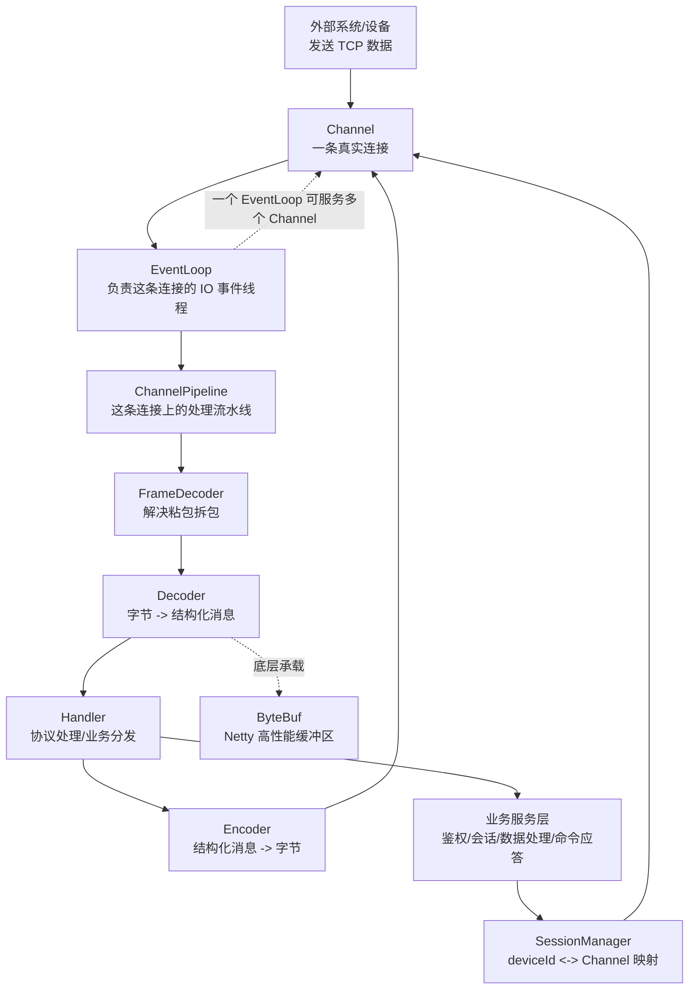
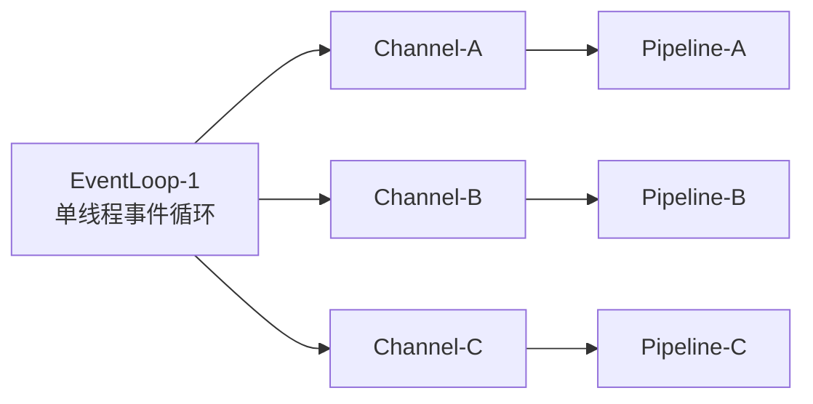
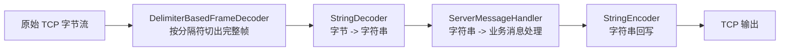
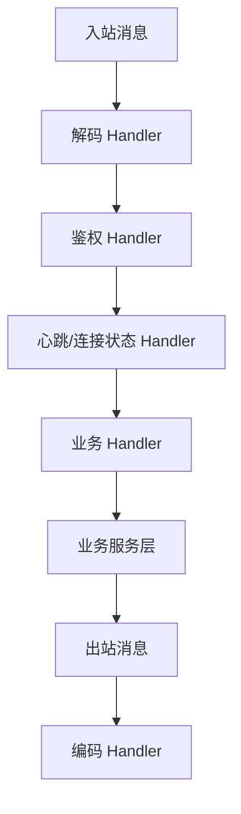
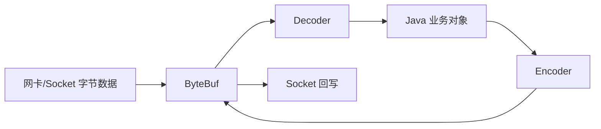
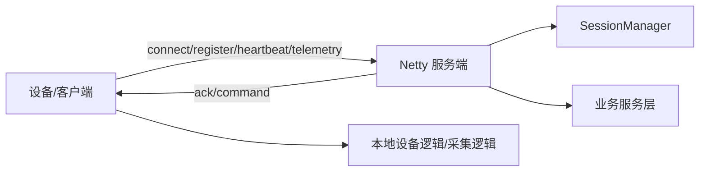
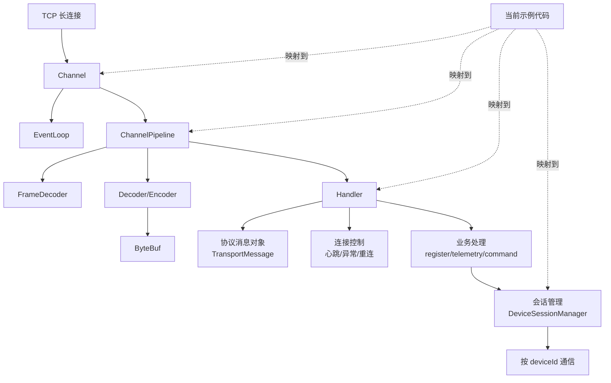

# Netty 知识文档

## 1. Netty 是什么

Netty 是一个基于 Java NIO 的高性能网络编程框架，本质上它帮我们把很多底层网络细节封装好了，比如：

- 连接建立
- 读写事件
- 编解码
- 粘包拆包处理
- 心跳检测
- 线程模型
- 高并发连接管理

你可以把它理解成：它不是协议本身，而是帮助你更稳定地实现 TCP、WebSocket、私有二进制协议通信的一套基础设施。

## 2. 为什么 IoT/TCP 接入经常会用 Netty

因为设备接入场景通常有这些特征：

- 长连接多
- 报文频繁
- 需要低延迟
- 有心跳保活
- 有掉线重连
- 需要解决粘包拆包
- 需要比较清晰的协议处理链路

这些都很适合用 Netty。

## 3. 你需要先建立的几个核心概念

### 3.0 先看一张概念关联图

如果你想先用一张图快速建立整体认知，可以先看这个：

这张图可以先帮助你抓住一条主线：

- 设备发来的数据，最终是进入某个 `Channel`
- `Channel` 的事件由某个 `EventLoop` 负责
- 数据会沿着这个 `Channel` 对应的 `Pipeline` 依次流过
- 中间通过解码器、Handler、编码器完成“字节流 <-> 业务消息”的转换
- 真正的业务处理通常还会再调用会话管理、鉴权、数据处理这些服务

如果你把这条主线吃透，再看具体 API 就会顺很多。

### 3.1 Channel

可以理解成“一条连接”。

- 服务端每接入一个设备，通常就对应一个 `Channel`
- 这个连接上的读写都通过 `Channel` 完成

### 3.2 EventLoop

可以理解成“负责处理一组连接 IO 事件的线程循环”。

特点：

- 一个 `EventLoop` 绑定一个线程
- 一个 `EventLoop` 可以服务多个 `Channel`
- 同一个 `Channel` 的事件通常由同一个 `EventLoop` 处理

这带来的好处是：

- 减少线程切换
- 并发模型更清晰
- 很多连接内状态处理不需要自己加很多锁

可以结合下面这张图一起理解：

这张图想表达的是：

- 不是“一个连接一个线程”
- 而是“一个 EventLoop 线程管理多个连接”
- 但每个连接又有自己独立的 `Pipeline`

这正是 Netty 比传统阻塞式模型更适合高并发连接场景的一个关键原因。

### 3.3 ChannelPipeline

它像一条处理流水线。

一条消息进来后，会按顺序经过多个 Handler：

- 先分帧
- 再解码
- 再做业务处理
- 再编码回写

比如本示例里的服务端 Pipeline：

1. `DelimiterBasedFrameDecoder`
2. `StringDecoder`
3. `StringEncoder`
4. `IdleStateHandler`
5. `ServerMessageHandler`

你可以把它想象成下面这个消息加工过程：

如果以后你换成二进制协议，这条链路仍然成立，只是中间节点会变成：

- `LengthFieldBasedFrameDecoder`
- 自定义 `ByteToMessageDecoder`
- 自定义业务 `Handler`
- 自定义 `MessageToByteEncoder`

### 3.4 ChannelHandler

就是流水线里的处理节点。

常见职责：

- 协议解码
- 鉴权
- 心跳处理
- 业务路由
- 异常处理

更接近真实项目的理解方式可以看这张图：

也就是说，`Handler` 不只是“收消息”，它其实是在连接层和业务层之间起到一个桥梁作用。

### 3.5 ByteBuf

Netty 对字节缓冲区的封装，比 JDK 原生 `ByteBuffer` 更好用、性能也更强。

你现在这个版本先用了字符串 JSON，等后续切到二进制协议时，你会重点和 `ByteBuf` 打交道。

它在概念上的位置，大概可以理解成这样：

所以 `ByteBuf` 更偏底层，它是“网络字节”和“上层消息对象”之间非常核心的一层承载。

## 4. 服务端和客户端各自做什么

你也可以把服务端和客户端的角色关系看成下面这个双边协作图：

这张图对应的现实含义是：

- 客户端更像“数据上报方”
- 服务端更像“连接接收方 + 指令控制方”
- 业务系统围绕这两边做会话管理、命令处理和数据消费

### 服务端

平台作为 TCP 服务端时，主要负责：

- 监听端口
- 接收设备连接
- 维护设备会话
- 接收设备上报
- 下发控制命令

### 客户端

平台作为 TCP 客户端时，主要负责：

- 主动连接第三方服务
- 保持长连接
- 断线重连
- 定时发送心跳
- 接收对端返回结果

你这次要求我同时给客户端和服务端，就是为了把这两种工作模式都串起来理解。

## 5. 粘包拆包到底是什么

TCP 是字节流，不是消息流。

这句话非常关键。意思是：

- 你发了 3 次消息，对方不一定收到 3 次
- 可能 3 条并成 1 条
- 也可能 1 条被拆成 2 次收到

所以业务上必须自己定义“消息边界”。

常见方案：

- 分隔符协议
- 固定长度协议
- 长度字段协议
- 自定义头 + body 协议

本示例用的是：

- 换行符分隔
- `DelimiterBasedFrameDecoder`

这是最容易上手的一种。

## 6. 心跳和空闲检测怎么理解

设备长连接不是“连上就完事”，还要知道连接是不是活着。

常见做法：

- 客户端定时发心跳
- 服务端如果一段时间没收到，就判定连接失活并关闭

在本示例里：

- 客户端通过 `IdleStateHandler` 触发写空闲，自动发 heartbeat
- 服务端通过 `IdleStateHandler` 监听读空闲，超时后关闭连接

## 7. 为什么要维护设备会话

因为你后面一定会遇到这种需求：

- 根据 `deviceId` 给某个设备单独下发命令
- 查询某个设备是否在线
- 记录最近心跳时间
- 判断重复登录

所以通常要维护：

- `deviceId -> Channel`
- `deviceId -> Session`

这就是示例里 `DeviceSessionManager` 的职责。

## 8. 真实项目里 Handler 不要写太重

新手很容易把所有业务全堆进 `channelRead0` 里。

更好的思路是：

1. Handler 负责协议层和连接层。
2. 把解析后的消息交给业务服务。
3. 业务服务再处理设备状态、数据库、告警、规则引擎等。

否则后面一复杂，Handler 会很难维护。

## 9. 你后面做 IoT 网关 TCP 接入时重点要补的内容

### 协议层

- 魔数
- 版本号
- 长度字段
- 序列号
- checksum
- 加密/签名

### 连接层

- 设备鉴权
- 重复登录踢除
- 黑名单
- 空闲超时
- 限流

### 业务层

- 上报数据入库
- 命令响应关联
- 超时重试
- 在线离线事件
- 告警事件

### 运维层

- 连接数监控
- 消息 TPS
- 异常报文统计
- 重连次数统计
- 堆外内存监控

## 10. 你可以怎么继续练

建议按这个顺序：

1. 先把这个 sample 运行起来。
2. 用接口触发 telemetry 和 command。
3. 自己把 JSON 协议改成“长度字段 + JSON”。
4. 再改成“二进制头 + body”。
5. 补一个设备鉴权流程。
6. 补一个命令应答超时表。

## 11. 常见坑

- 忘记处理粘包拆包
- 没有心跳，连接假死
- `Channel` 断开后 session 没清理
- 业务阻塞 EventLoop 线程
- 把耗时 IO 直接写进 Handler
- 没有对非法报文做保护
- 报文过大没有限制
- 没有做设备重复登录治理

## 12. 这套示例和真实项目的关系

这套代码不是“直接上线”的最终版，但它已经把你后续真实项目最关键的骨架铺好了：

- 服务端接入模型
- 客户端连接模型
- 消息分发模型
- 设备会话模型
- 心跳与重连模型

你后面真正要替换的，主要是“协议细节”和“业务处理细节”。

最后再给你一张“从概念到落地代码”的总览图，方便你把本文和 `solution-netty` 的代码一起对应起来：

如果你后面再回头看这篇文档，建议按这个顺序去记：

1. `Channel` 是连接本身
2. `EventLoop` 是处理连接事件的线程
3. `Pipeline` 是消息处理流水线
4. `Handler` 是流水线里的处理节点
5. `ByteBuf` 是底层字节承载
6. 业务系统是在这些能力之上实现设备会话、心跳、命令和数据上报的
