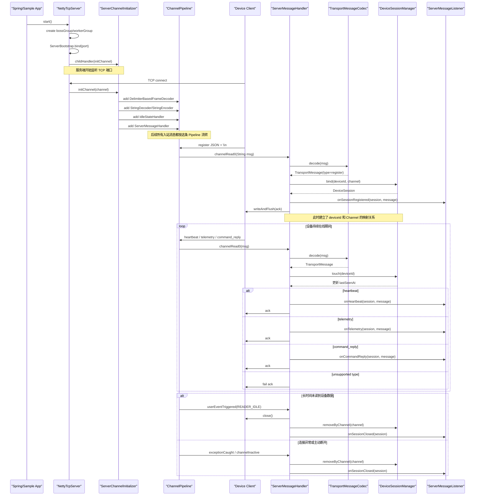
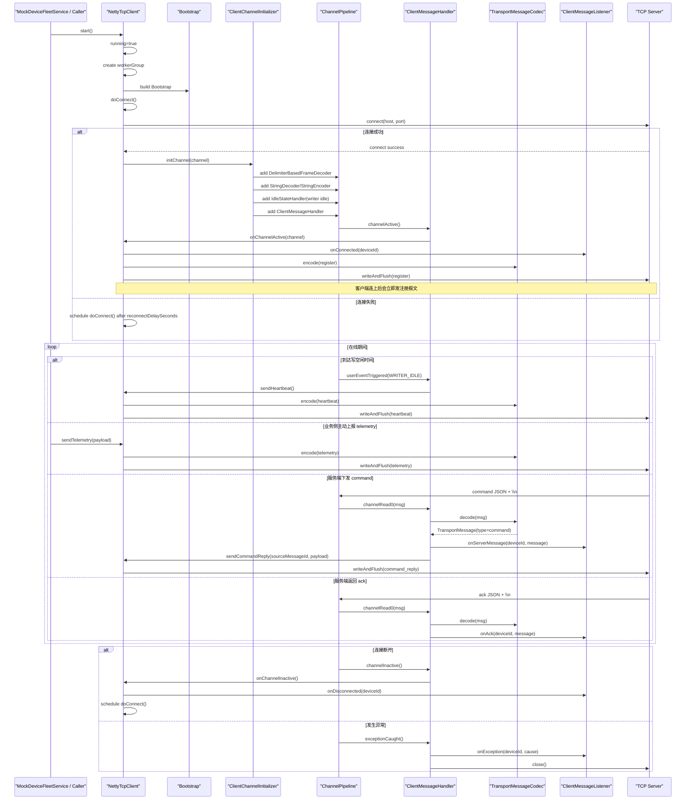

# Netty 服务端/客户端时序图

这份文档只聚焦当前 `solution-netty` 里的真实代码实现，帮助你把“类之间怎么协作”“消息怎么流转”“连接生命周期怎么推进”看得更清楚。

关联代码入口：

- 服务端入口：[NettyTcpServer.java](/D:/workspace/github/solution-hub/solution-netty/netty-core/src/main/java/com/cv/netty/core/server/NettyTcpServer.java)
- 服务端初始化：[ServerChannelInitializer.java](/D:/workspace/github/solution-hub/solution-netty/netty-core/src/main/java/com/cv/netty/core/server/ServerChannelInitializer.java)
- 服务端消息处理：[ServerMessageHandler.java](/D:/workspace/github/solution-hub/solution-netty/netty-core/src/main/java/com/cv/netty/core/server/ServerMessageHandler.java)
- 会话管理：[DeviceSessionManager.java](/D:/workspace/github/solution-hub/solution-netty/netty-core/src/main/java/com/cv/netty/core/server/DeviceSessionManager.java)
- 客户端入口：[NettyTcpClient.java](/D:/workspace/github/solution-hub/solution-netty/netty-core/src/main/java/com/cv/netty/core/client/NettyTcpClient.java)
- 客户端初始化：[ClientChannelInitializer.java](/D:/workspace/github/solution-hub/solution-netty/netty-core/src/main/java/com/cv/netty/core/client/ClientChannelInitializer.java)
- 客户端消息处理：[ClientMessageHandler.java](/D:/workspace/github/solution-hub/solution-netty/netty-core/src/main/java/com/cv/netty/core/client/ClientMessageHandler.java)
- 示例控制入口：[NettyDemoController.java](/D:/workspace/github/solution-hub/solution-netty/netty-sample/src/main/java/com/cv/netty/sample/controller/NettyDemoController.java)

## 1. 服务端接收设备连接时序图

这个时序图对应的是“设备作为 TCP 客户端接入平台服务端”的链路，也就是你后面做 IoT 网关 TCP 接入时最常见的一种模式。



## 2. 服务端链路补充说明

### 2.1 启动阶段

`NettyTcpServer.start()` 做了几件核心事：

- 创建 `bossGroup`
  负责接收新连接。
- 创建 `workerGroup`
  负责处理已建立连接上的读写事件。
- 通过 `ServerBootstrap` 绑定端口。
- 通过 `ServerChannelInitializer` 给每条新连接组装 `Pipeline`。

你可以把它理解成：

- `NettyTcpServer` 负责“把服务端搭起来”
- `ServerChannelInitializer` 负责“给每条连接装配处理流水线”
- `ServerMessageHandler` 负责“真的处理业务消息”

### 2.2 注册报文为什么重要

当前这套代码里，设备连接建立后第一件关键事是发送 `register`。

原因是 TCP 层只知道“来了一个连接”，但业务层还不知道：

- 这是哪个设备
- 后续下发命令应该发给谁
- 这个连接对应哪个 `deviceId`

所以 `register` 的作用是把“网络连接”提升成“业务设备连接”。

对应代码动作：

- `ServerMessageHandler.handleRegister(...)`
- `channel.attr(NettyConstants.ATTR_DEVICE_ID).set(deviceId)`
- `DeviceSessionManager.bind(deviceId, channel)`

执行完后，服务端才具备：

- 查询在线设备
- 根据 `deviceId` 下发命令
- 记录最后活跃时间

### 2.3 为什么先解码再分发

设备发进来的原始数据先是文本：

```text
{"type":"telemetry","deviceId":"mock-device-01",...}\n
```

进入 `Pipeline` 之后按下面顺序处理：

1. `DelimiterBasedFrameDecoder`
   先按换行符切出一条完整消息，解决最基础的粘包拆包问题。
2. `StringDecoder`
   把字节流转成 `String`。
3. `ServerMessageHandler`
   再交给 `TransportMessageCodec.decode()` 反序列化成 `TransportMessage`。

这一步非常关键，因为业务 Handler 最好处理“结构化对象”，而不是直接处理原始字节。

### 2.4 会话管理是怎么工作的

`DeviceSessionManager` 维护了三类核心映射：

- `deviceId -> DeviceSession`
- `deviceId -> Channel`
- `channelId -> deviceId`

这样做的目的分别是：

- 通过 `deviceId` 查在线状态
- 通过 `deviceId` 发消息给对应设备
- 在连接断开时，反向找到这个连接对应哪个设备并清理会话

### 2.5 服务端怎么给设备下发命令

下发链路的入口不是 Handler，而是外部业务调用：

- `NettyDemoController /server/command`
- `NettyTcpServer.sendCommandToDevice(...)`
- `DeviceSessionManager.send(deviceId, message)`
- `channel.writeAndFlush(...)`

也就是说：

- 入站消息走 `Pipeline -> Handler`
- 出站命令走 `业务入口 -> SessionManager -> Channel`

这两条路径你要分开理解。

## 3. 客户端主动连接平台时序图

这个时序图对应的是当前 `NettyTcpClient` 的行为。它很适合拿来理解“设备端 SDK”或者“平台作为客户端去连第三方 TCP 服务”的实现方式。



## 4. 客户端链路补充说明

### 4.1 `NettyTcpClient` 的职责边界

`NettyTcpClient` 不是一个单纯的 Socket 包装类，它承担了几层职责：

- 连接建立
- 断线重连
- 心跳发送
- 注册报文发送
- telemetry 上报
- command reply 回传

也就是说，它本质上已经有一点“设备接入 SDK”的味道了。

### 4.2 为什么 `channelActive()` 里就发注册

在当前代码里，连接成功后会立刻调用：

- `ClientMessageHandler.channelActive()`
- `NettyTcpClient.onChannelActive(channel)`
- `send(register message)`

这样做的好处是：

- 服务端可以立刻建立会话
- 后续心跳和 telemetry 都能带着明确的 `deviceId`
- 平台能更快知道“哪个设备上线了”

如果后续接真实协议，你可以把这里扩展成：

1. 建连
2. 鉴权
3. 注册
4. 同步设备版本/能力

### 4.3 心跳为什么由 `IdleStateHandler` 触发

客户端 Pipeline 里加了：

- `IdleStateHandler(0, heartbeatSeconds, 0, TimeUnit.SECONDS)`

意思是：

- 一段时间没有写数据，就触发 `WRITER_IDLE`

然后 `ClientMessageHandler.userEventTriggered(...)` 里调用：

- `client.sendHeartbeat()`

这种写法的好处是，心跳逻辑不用自己写定时器，直接挂在 Netty 的事件体系里，更贴近连接本身。

### 4.4 服务端 command 到客户端 command_reply 的链路

这一段是后面设备控制场景里很常见的流程。

当前实现是：

1. 服务端通过 `NettyTcpServer.sendCommandToDevice(...)` 下发 `command`
2. 客户端 `ClientMessageHandler.channelRead0(...)` 收到 `command`
3. 先回调 `listener.onServerMessage(...)`
4. 然后自动构造 `command_reply`
5. 调用 `NettyTcpClient.sendCommandReply(...)` 回传

你可以把它理解成一个最小闭环：

- 平台下发控制指令
- 设备收到后确认处理
- 平台拿到应答结果

真实项目中，这里一般还会继续补：

- 命令流水号
- 超时控制
- 指令执行状态机
- 重试机制
- 应答结果持久化

## 5. 当前代码里的完整数据流转视角

如果把这套代码抽象成“几个层次”，会更容易形成整体认知。

### 5.1 连接层

负责：

- 建连
- 断连
- 空闲检测
- 重连

对应类：

- `NettyTcpServer`
- `NettyTcpClient`
- `ServerChannelInitializer`
- `ClientChannelInitializer`

### 5.2 编解码层

负责：

- 分帧
- 字节到字符串
- 字符串到对象
- 对象到字符串

对应类：

- `DelimiterBasedFrameDecoder`
- `StringDecoder`
- `StringEncoder`
- `TransportMessageCodec`

### 5.3 协议处理层

负责：

- register
- heartbeat
- telemetry
- command
- command_reply
- ack

对应类：

- `ServerMessageHandler`
- `ClientMessageHandler`

### 5.4 会话层

负责：

- 建立设备在线会话
- 维护设备与连接映射
- 支持按设备发消息

对应类：

- `DeviceSessionManager`
- `DeviceSession`

### 5.5 业务入口层

负责：

- 提供外部触发点
- 观察当前运行状态
- 人工触发上报或指令

对应类：

- `NettyDemoController`
- `MockDeviceFleetService`
- `SampleServerMessageListener`

## 6. 你后面看这套代码时，建议重点盯住的几个问题

建议你一边读代码，一边反复问自己下面这些问题：

1. 一条 TCP 连接在代码里具体落到哪个对象上了？
   答案是 `Channel`。

2. 一条原始报文是在哪一步变成 Java 对象的？
   答案是 `TransportMessageCodec.decode()`。

3. 服务端是在哪一步知道“这是哪个设备”的？
   答案是 `register` 报文触发 `DeviceSessionManager.bind(...)`。

4. 服务端为什么能按 `deviceId` 下发命令？
   答案是 `DeviceSessionManager` 保存了 `deviceId -> Channel` 映射。

5. 客户端为什么会自动发心跳？
   答案是 `IdleStateHandler` 触发 `WRITER_IDLE` 后由 `ClientMessageHandler` 调用 `sendHeartbeat()`。

6. 连接断开后为什么还能自动恢复？
   答案是 `NettyTcpClient.onChannelInactive()` 里会调度 `doConnect()` 重新连接。

## 7. 后续如果你要继续深化，可以优先扩展哪几块

如果你想把这套代码进一步往生产场景推，最值得优先升级的是：

1. `TransportMessageCodec`
   从“换行分隔 JSON”升级为“长度字段协议”或“二进制协议”。

2. `ServerMessageHandler`
   补充设备鉴权、重复登录处理、非法报文保护。

3. `DeviceSessionManager`
   接 Redis，支持分布式节点间共享设备在线状态。

4. command 流程
   增加请求和应答的关联、超时控制、重试策略。

5. telemetry 流程
   接数据库、消息队列或规则引擎，形成真正的设备数据处理链路。

