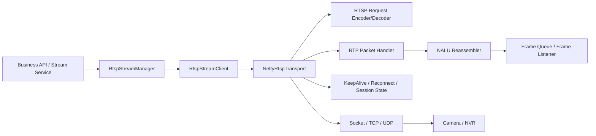
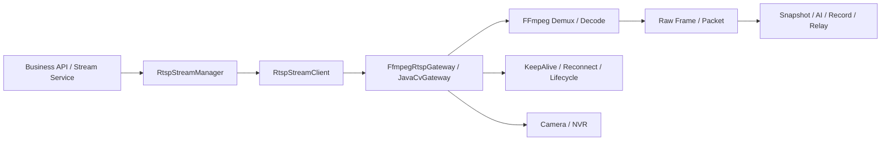
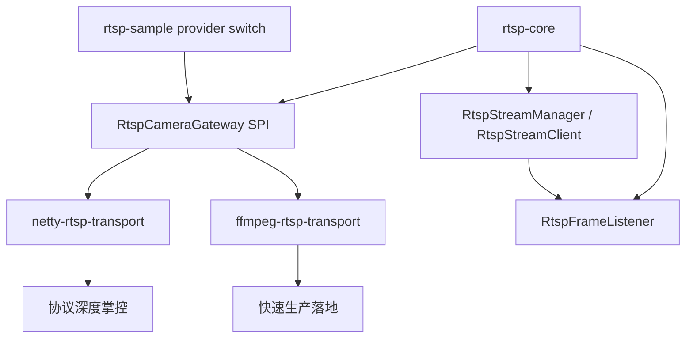

# RTSP 方案选型文档

## 1. 文档目标

这份文档用于回答一个很实际的问题：

当前项目在接入 RTSP 视频流时，应该选择：

1. `纯 Java / Netty 自研 RTSP 传输层`
2. `基于 FFmpeg / JavaCV 的生产落地方案`

结论先说：

- 如果你更关注协议掌控、接入网关能力沉淀，优先考虑 `纯 Java / Netty`
- 如果你更关注快速上线、截图转码、稳定生产落地，优先考虑 `FFmpeg / JavaCV`

更推荐的工程实践不是二选一，而是：

- `core` 层保持现在这种无强绑定的抽象
- 下面同时允许挂 `netty-transport` 和 `ffmpeg-transport`
- sample 通过配置切换 provider

这样可以同时兼顾演进空间和交付速度。

## 2. 两种方案的本质区别

### 2.1 纯 Java / Netty 方案

核心思路：

- 自己实现 RTSP 请求响应收发
- 自己管理 `OPTIONS / DESCRIBE / SETUP / PLAY / TEARDOWN`
- 自己处理 RTP over TCP 或 RTP over UDP
- 自己做 H264/H265 NALU 重组、丢包处理、时间戳处理
- 解码、截图、转码能力再决定是否接其他模块

它更像是在做一个“媒体接入网关”。

### 2.2 FFmpeg / JavaCV 方案

核心思路：

- 用成熟媒体库处理底层拉流、解码、转码
- 我们自己保留上层业务编排、生命周期管理、重连、监控、回调接口
- 把复杂的音视频细节尽量交给成熟组件

它更像是在做一个“业务可用的视频接入服务”。

## 3. 架构图

### 3.1 方案一：纯 Java / Netty 自研传输层



### 3.2 方案二：FFmpeg / JavaCV 生产落地方案



### 3.3 推荐组合架构



## 4. 优缺点对比

| 维度 | 纯 Java / Netty | FFmpeg / JavaCV |
|------|-----------------|-----------------|
| 依赖复杂度 | 低 | 中到高 |
| 协议掌控力 | 很高 | 中 |
| 开发速度 | 慢 | 快 |
| 媒体能力完备度 | 低，需要自建 | 高 |
| 调试 RTSP/RTP 细节 | 强 | 一般 |
| 截图/解码/转码 | 需要补很多 | 更成熟 |
| 厂商兼容性 | 靠自己积累 | 往往更好 |
| 团队门槛 | 高 | 中 |
| 适合长期沉淀平台 | 很适合 | 适合业务交付 |

## 5. 适用场景

### 5.1 适合选纯 Java / Netty 的情况

- 你们希望沉淀自己的 RTSP/RTP 接入能力
- 只需要做流管理，不急着做复杂解码转码
- 后续可能接多种私有协议、国标、设备网关
- 团队里有人能长期维护协议细节
- 你们更关心“平台能力”而不是“快速交付视频功能”

### 5.2 适合选 FFmpeg / JavaCV 的情况

- 项目要尽快上线
- 需要截图、录制、抽帧、AI 前处理
- 需要转 HLS、FLV、RTMP、WebRTC
- 设备品牌多、现场兼容性复杂
- 团队主要是后端工程师，不想深啃音视频底层

## 6. 工程复杂度拆解

### 6.1 如果你走纯 Java / Netty，需要自己补哪些东西

- RTSP 文本协议编解码
- Basic / Digest 鉴权
- SDP 解析
- RTP 包解析
- TCP interleaved 支持
- UDP 收包与端口管理
- H264/H265 FU-A 等分片重组
- 时间戳与帧边界识别
- 抖动缓冲与乱序处理
- 音视频同步
- 断流恢复

这还没算后面的：

- JPEG 截图
- MP4 录制
- HLS 切片
- WebRTC 转推

所以它真正难的地方不在 RTSP 本身，而在 RTP 和媒体处理链路。

### 6.2 如果你走 FFmpeg / JavaCV，需要重点关注什么

- native 依赖打包
- 宿主机环境兼容
- 不同平台的库版本管理
- 进程/线程/句柄释放
- 长时间运行时的内存监控
- 出错重试和流重建策略

它的难点更多在“工程运维”和“资源管理”，而不是协议本身。

## 7. 推荐目录结构

### 7.1 偏平台型目录结构

```text
solution-rtsp
├─ rtsp-core
│  ├─ model
│  ├─ client
│  ├─ manager
│  ├─ gateway
│  └─ listener
├─ rtsp-netty-transport
│  ├─ codec
│  ├─ rtsp
│  ├─ rtp
│  ├─ sdp
│  └─ reconnect
└─ rtsp-sample
```

适合：后续要把 RTSP 作为基础设施能力长期建设。

### 7.2 偏业务交付型目录结构

```text
solution-rtsp
├─ rtsp-core
│  ├─ model
│  ├─ client
│  ├─ manager
│  ├─ gateway
│  └─ listener
├─ rtsp-ffmpeg-bridge
│  ├─ grabber
│  ├─ decoder
│  ├─ recorder
│  └─ snapshot
└─ rtsp-sample
```

适合：先交付项目，再逐步做平台化抽象。

## 8. 推荐的演进路线

### 8.1 第一阶段

保持当前 `rtsp-core` 结构不变，先把接入编排统一下来：

- endpoint
- session
- manager
- listener
- snapshot
- metrics

### 8.2 第二阶段

新增真实底层实现，不破坏 sample：

- `MockRtspCameraGateway`
- `FfmpegRtspCameraGateway`

这一步的目标是先把真实摄像头拉起来。

### 8.3 第三阶段

在真实拉流基础上补业务能力：

- 抓拍
- 录像
- AI 分析前置抽帧
- 流在线状态监控
- 指标告警

### 8.4 第四阶段

如果后续确实有必要，再建设自研 transport：

- `NettyRtspCameraGateway`
- `RtpPacketReassembler`
- `SdpParser`
- `DigestAuthenticator`

这时 `FFmpeg` 方案仍然可以保留作为稳定兜底。

## 9. 最推荐的决策

如果你现在问的是“这个仓库下一步应该怎么走”，我给的建议是：

1. `rtsp-core` 保持现在这种轻依赖抽象层
2. 下一步优先新增 `ffmpeg/javacv` 版本的真实生产桥接模块
3. `netty` 版作为后续可选增强，不要一开始就重投

原因很简单：

- 现在最先缺的是“能接真实流、能截图、能转码、能跑生产”
- 不是“能手搓完整 RTP 栈”

## 10. 一句话结论

- 想做“基础设施能力沉淀”，选 `Netty 自研`
- 想做“业务快速上线并稳定交付”，选 `FFmpeg / JavaCV`
- 对当前仓库最稳的路线，是 `core 抽象 + FFmpeg 落地 + Netty 预留扩展`
