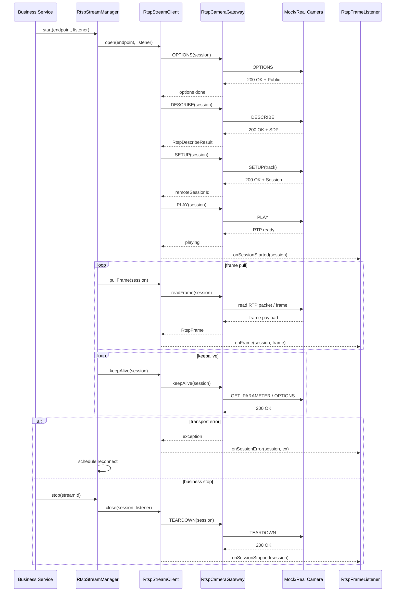

# rtsp-core 功能介绍

## 1. 模块目标

`rtsp-core` 解决的是 RTSP 视频流接入里最容易散落在业务代码中的共性问题：

- 标准化会话协商流程
- 统一鉴权与流地址配置
- 将 `OPTIONS / DESCRIBE / SETUP / PLAY / TEARDOWN` 做成可复用编排
- 为保活、自动重连、帧消费、监控指标预留清晰扩展点

这个版本用 Mock Gateway 模拟真实摄像头行为，因此可以先把流程、对象边界和调用方式稳定下来，再接真实底层实现。

当前推荐的 SPI 落地方式是：

- `mock gateway`
- `netty transport gateway`
- `ffmpeg bridge gateway`

`rtsp-core` 不和任何一种实现强绑定，因此可以自然做成可选择、可拔插。

## 2. 核心组件

- `RtspEndpoint`
  统一承载流地址、账号密码、超时、保活周期、帧拉取频率、自动重连策略。
- `RtspCameraGateway`
  RTSP 传输层抽象，生产里可以替换为 Netty、JavaCV、FFmpeg、GStreamer 或厂商 SDK。
- `RtspStreamClient`
  单路流的会话编排器，负责完成标准握手和单次帧拉取。
- `RtspStreamManager`
  多路流统一调度器，负责定时保活、连续拉帧、失败重连、停止释放。
- `RtspFrameListener`
  对接业务消费的扩展接口，适合挂接截图、录像、AI 识别、转推、审计日志。
- `MockRtspCameraGateway`
  sample 和测试使用的模拟 RTSP 摄像头实现。

## 3. 默认流程

```text
register endpoint
  -> OPTIONS
  -> DESCRIBE
  -> SETUP
  -> PLAY
  -> periodic frame pull
  -> periodic keepalive
  -> failure reconnect or teardown
```

## 4. 核心流程时序图



## 5. 生产接入建议

- 将 `MockRtspCameraGateway` 替换为真实 RTSP I/O 后，优先补齐 digest/basic 鉴权、TCP/UDP transport、RTP interleaved 支持。
- `RtspFrameListener` 内不要直接做重 CPU 操作，建议异步投递到线程池或消息队列。
- `RtspSessionMetrics` 建议上报为 Prometheus 指标，用于观察断流、重连和帧速率。
- 如果你们要接国标、厂商 SDK 或 WebRTC 转推，可以把 `Gateway` 继续拆成更细的 transport / codec / relay 三层。
